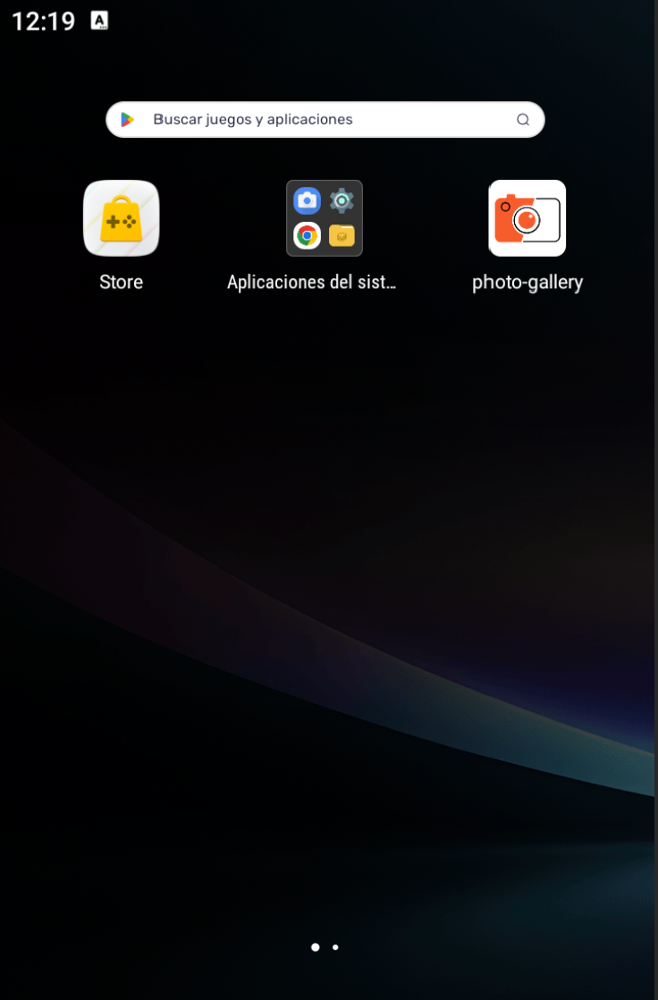

# 📱 Aplicación Ionic - Cámara y Alertas

## 📌 Descripción

Este proyecto consiste en el desarrollo de una aplicación móvil utilizando Ionic y Angular.
La aplicación permite interactuar con el usuario mediante alertas y capturar imágenes usando la cámara del dispositivo.

## 🚀 Funcionalidades
* 🔔 Mostrar alertas personalizadas
* ✅ Confirmaciones con botones
* 📷 Captura de fotos con la cámara
* 🖼️ Visualización de imágenes guardadas
* 💾 Almacenamiento local de datos

## 🛠️ Tecnologías utilizadas
* Ionic Framework
* Angular
* Capacitor
* TypeScript

## 📸 Capturas de la aplicación

### 🏠 Pantalla principal

### 🔔 Alerta en funcionamiento

Se muestra el uso del servicio de alertas implementado en la aplicación.
Alerta 1

Alerta 2

### 📷 Uso de cámara

Captura de imagen desde el dispositivo móvil.

### 🖼️ Galería de imágenes

Visualización de imágenes almacenadas localmente.

## 📱 Icono de la aplicación móvil
Visualización del icono de la app

## 📱 Ejecución en dispositivo real

La aplicación fue probada en un dispositivo físico con Android 11, demostrando el correcto funcionamiento de la cámara, almacenamiento y alertas.

https://www.youtube.com/shorts/P6yC1tEPZ4s

## ⚙️ Instalación

1. Clonar el repositorio:
git clone https://github.com/WilmerRamos21/photo-gallery.git
2. Instalar dependencias:
npm install
3. Ejecutar en navegador:
ionic serve
4. Ejecutar en Android:
ionic capacitor run android

## 🎨 Personalización de la aplicación

### 🟢 Ícono de la aplicación
Se implementó un ícono personalizado para la aplicación utilizando Capacitor.

1. Para ello se creó el archivo:
resources/icon.png

2. Luego se ejecutó el comando:
npx capacitor-assets generate

---

### 🔵 Splash Screen
Se añadió una pantalla de inicio personalizada (Splash Screen) que se muestra al abrir la aplicación.

- Archivo utilizado:
resources/icon.png

---

### ⚙️ Configuración realizada
- npm install @capacitor/assets –save-dev
- npx capacitor-assets generate
- ionic capacitor sync

---

### 📱 Resultado
La aplicación ahora cuenta con:
- ✔ Ícono personalizado
- ✔ Splash Screen personalizado
- ✔ Mejor presentación visual

## 👨‍💻 Autor

Wilmer Adrian Ramos
